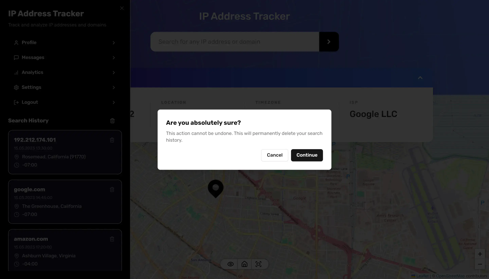

# Frontend Mentor - IP address tracker solution

This is a solution to the [IP address tracker challenge on Frontend Mentor](https://www.frontendmentor.io/challenges/ip-address-tracker-I8-0yYAH0). Frontend Mentor challenges help you improve your coding skills by building realistic projects.

- Live Site URL: [https://kerem-gurbuz-fm-ip-address-tracker.vercel.app](https://kerem-gurbuz-fm-ip-address-tracker.vercel.app)

## Table of contents

- [Overview](#overview)
- [Built with](#built-with)
- [Author](#author)

## Overview

### The challenge

Users should be able to:

- View the optimal layout for each page depending on their device's screen size
- See hover states for all interactive elements on the page
- See their own IP address on the map on the initial page load
- Search for any IP addresses or domains and see the key information and location

### Screenshots

<table>
  <tr>
    <td align="center">md-screenshot-1</td>
    <td align="center">md-screenshot-2</td>
  </tr>
  <tr>
    <td></td>
    <td></td>
  </tr>
</table>

<table>
  <tr>
    <td align="center">sm-screenshot-1</td>
    <td align="center">sm-screenshot-2</td>
    <td align="center">sm-screenshot-3</td>
    <td align="center">sm-screenshot-4</td>
  </tr>
  <tr>
    <td></td>
    <td></td>
    <td></td>
    <td></td>
  </tr>
</table>

## Built with

- [Next.js | TypeScript](https://nextjs.org/) - React framework
- [Redux Toolkit](https://redux-toolkit.js.org/) - Global state management
- [TanStack Query (FKA React Query)](https://tanstack.com/query/) - Data fetching, caching, synchronizing and updating server state
- [React Hook Form](https://react-hook-form.com/) - Form handling and validation
- [Zod](https://zod.dev/) - TypeScript-first schema declaration and validation
- [Tailwind CSS](https://tailwindcss.com/) - Utility-first CSS framework
- [shadcn/ui](https://ui.shadcn.com/) - Accessible, customizable UI components
- Mobile-first workflow

## Author

- LinkedIn - [Kerem Gurbuz](https://www.linkedin.com/in/gurbuz-kerem)
- Frontend Mentor - [@kerem-gurbuz](https://www.frontendmentor.io/profile/kerem-gurbuz)
